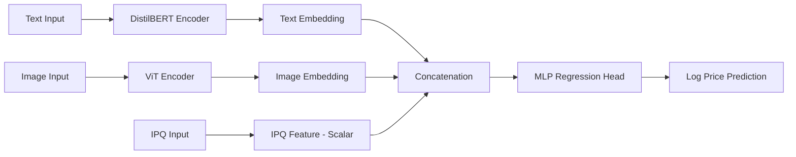

# ML Challenge 2025: Smart Product Pricing Solution

**Team Name:** mlchamps  
**Team Members:** Anchal Nagwanshi, Noma, Utkarsh Chauhan  
**Submission Date:** October 13th, 2025

---

## 1. Executive Summary
*Our solution addresses the smart product pricing challenge by leveraging a Multimodal Deep Learning Architecture that jointly processes text, image, and tabular features. The core innovation is the use of pre-trained Transformer models—**DistilBERT for text** and **ViT (Vision Transformer) for images**—combined with a Hybrid Loss Function optimized for the competition's Symmetric Mean Absolute Percentage Error (SMAPE) metric. This approach allows the model to capture complex relationships across all available product data for robust price prediction.*

---

## 2. Methodology Overview

### 2.1 Problem Analysis
The challenge requires predicting product price (`price`) using complex multimodal data (`catalog_content` text and `image_link`). Key insights during analysis included:

1. **Multimodal Necessity:** Pricing decisions are inherently based on both descriptive text (brand, features) and visual appearance (quality, style), mandating a combined modeling approach.

2. **Target Skew:** The price target variable showed a positive skew, which was addressed by applying log-transformation (`log(1+price)`) to stabilize variance and improve model convergence during training.

3. **Critical Feature Extraction:** The catalog_content field contains embedded, quantifiable product details, specifically the Item Pack Quantity (`IPQ`), which is a direct, linear price driver and was extracted as an explicit tabular feature.

**Key Observations:**
* Target transformation to log-scale (log1p) is essential for regression.

* IPQ is a powerful explicit feature that must be isolated from the text for separate, stable integration.

### 2.2 Solution Strategy
*We adopted a **Hybrid Multimodal Transfer Learning** strategy. We fine-tuned large, pre-trained encoders (Text and Vision) and fused their embeddings with the engineered IPQ feature before passing the combined representation to a final regression head.*

**Approach Type:** Hybrid Multimodal Deep Learning (Transfer Learning)  
**Core Innovation:** **Custom Hybrid Loss Function** and **Tiered Learning Rate** strategy to optimize directly for the SMAPE evaluation metric while maintaining training stability.

---

## 3. Model Architecture

### 3.1 Architecture Overview
*The architecture consists of three input streams (Text, Image, Tabular) that process features independently and then concatenate them before a final Multi-Layer Perceptron (MLP) regression head predicts the target price (in log space).*

#### Model Architecture Flowchart

### 3.2 Model Components

**Text Processing Pipeline:**
- [ ] Preprocessing steps: Tokenization, Padding, Truncation (`max_length=128`), log1p target transform.
- [ ] Model type: DistilBERT Base Uncased
- [ ] Key parameters: LR=`3e-5` (Encoder), Weight Decay=`0.01`, Warmup Ratio=`0.05`.

**Image Processing Pipeline:**
- [ ] Preprocessing steps: Resize, Normalization (handled by `AutoImageProcessor`), Image placeholder for missing files.
- [ ] Model type: ViT (Vision Transformer) Base Patch16 224 in21k
- [ ] Key parameters: LR=`3e-5` (Encoder), Weight Decay=`0.01`

**Loss Function and Optimization:**

**Hybrid Loss:** The training objective uses a weighted combination of a custom **Smooth SMAPE Loss** (`80%`) and the stable **Huber Loss** (`20%, δ=1.0`) applied to the log-transformed price. This ensures the model is directly optimized for SMAPE while preventing explosive gradients.

**Optimizer:** AdamW with Tiered Learning Rates and a Linear Scheduler with Warmup. The new regression head uses LR=`3e-4`, 10× higher than the fine-tuning LR for the pre-trained encoders.

---

## 4. Model Performance

### 4.1 Validation Results
The model was trained for 7 epochs with early stopping patience of 3 epochs, using a 15% validation split (`VAL_SPLIT_SIZE=0.15`). The performance metrics were calculated on the original price scale after inverse transforming the predictions (expm1).
- **Best Validation SMAPE Score:** `46.0416%`
- **Best Validation SMAPE Score upon evaluation of submitted `test_out.csv`:** `46.018%`

## 5. Conclusion
*This multimodal approach successfully integrates product catalog text, images, and engineered features into a single price prediction pipeline. The use of DistilBERT and ViT for feature extraction, combined with careful tuning of the learning rates and the custom SMAPE-centric loss function, yielded a best validation SMAPE of 46.0416%. Future work could explore incorporating more text-based features, such as categorical variables derived from the catalog content, and ensemble methods.*

---

## Appendix

### A. Code artefacts
https://github.com/nomaalam/amazon-ml-challenge-2025/

---